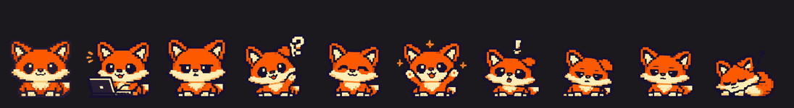

<div align="center">


# Foxbot

**A fox who sits on your screen and tells you what your Claude Code sessions are doing — while they're doing it.**

Run more than one Claude Code session and you lose track of which one is
thinking, which one finished, and which one has been quietly blocked on a
question for twenty minutes. Foxbot puts a small fox on your desktop who
**glows blue while a session works**, **turns amber and keeps asking until you
answer a question**, and **goes green when it lands** — with how long it took
and what it cost in tokens.

**[Setup](#setup)** ·
**[What he does](#what-he-does)** ·
**[Questions](#he-wont-let-you-miss-a-question)** ·
**[Live notes](#live-progress-notes)** ·
**[Cost](#what-a-turn-cost)** ·
**[CLI](#from-a-terminal)** ·
**[How it works](#how-it-works)** ·
**[Security](SECURITY.md)**

</div>

---

# Setup

macOS only.

```bash
git clone https://github.com/svaka2000/foxbot.git
cd foxbot && ./install.sh
```

That installs Hammerspoon via Homebrew if you don't have it, puts the fox in
`~/.hammerspoon/foxbot/`, the hook in `~/.claude/hooks/`, and the `foxbot`
command in `~/.local/bin/`. Your existing hooks are left alone — `settings.json`
is backed up first and the installer only ever appends.

Then check him:

```bash
foxbot doctor
```

**No macOS permissions are required.** Hammerspoon asks for Accessibility on
first launch because Hammerspoon always does; the fox doesn't use it. Dragging
polls the mouse specifically so it works with that permission refused.

<details>
<summary><b>Or paste this into Claude Code and let it do the whole thing</b></summary>

<br>

```text
Install Foxbot from https://github.com/svaka2000/foxbot

Do all of it, don't ask me to run anything myself:

1. Clone the repo into ~/Downloads/current-projects (create the folder if needed).
   If it's already there, git pull instead.
2. Run ./install.sh and show me any errors. It installs Hammerspoon via Homebrew
   if missing, copies the fox to ~/.hammerspoon/foxbot/, the hook to
   ~/.claude/hooks/foxbot.sh, and the `foxbot` CLI to ~/.local/bin/. Then it wires
   the hook into my ~/.claude/settings.json under UserPromptSubmit, PostToolUse,
   Stop, SessionEnd, Notification and PreToolUse — WITHOUT removing hooks I
   already have. It backs that file up first; tell me where the backup went.
3. Confirm Hammerspoon is running (pgrep -x Hammerspoon) and that the fox appeared
   on the right edge of my screen. He sets launch-at-login himself, so don't
   change any Hammerspoon preferences by hand.
4. Print the hook entries from settings.json so I can see my own are still intact
   alongside the new ones.
5. Run ~/.local/bin/foxbot doctor and show me the output. Every line should say ok.
6. Do NOT enable Hammerspoon's AppleScript bridge. It is off by default on
   purpose and the install doesn't need it.

Then tell me in a few lines: where he is on screen, how to drag him, how to open
his menu, the hide/show and stats shortcuts, and how to get him back if I quit.
I do NOT need to grant Accessibility — say so if Hammerspoon warns about it.
```

</details>

Sessions already running pick the hooks up automatically. Next turn you send, he
goes blue; when it lands he tells you which one:

> **payments-api** &nbsp;&nbsp;&nbsp; `4m 12s · 51.5k`
> finished.
> · committed: add password reset
> · edited login.ts, token.ts

Click the note to jump to that session's terminal tab, or use the buttons along
the bottom to open the folder, open it in your editor, or copy the summary.

---

## What he does

| | |
|---|---|
| **Live status** | blue while a session runs, and a count in the menu bar |
| **Won't let you miss a question** | stays amber and keeps reminding you |
| **Per-turn timing and cost** | `4m 12s · 51.5k`, from the real transcript |
| **What actually changed** | summaries built from files and commands, not prose |
| **Live progress notes** | rate-limited, never repetitive |
| **One dial for noise** | needed / normal / chatty, instead of nine switches |
| **A focus timer** | 25 and 5, in the menu bar, never auto-starting the next |
| **Notices you've drifted** | opt-in, and only when something's actually waiting |
| **Teaches you things** | ~60 shipped tips, never repeating until you've seen them all |
| **Shows you around** | a five-step tour the first time, then never again |
| **Today / this week** | turns, time, tokens, per-project, streaks |
| **Donuts** | earned by working, spent on how he looks — never on what he does |
| **Any terminal** | iTerm, Ghostty, WezTerm, Warp, kitty, Alacritty, VS Code, Cursor, Zed |
| **Quiet hours** | plus automatic silence while you're screen sharing |
| **Catch-up** | one summary when you come back, not eleven stale notes |
| **Per project** | mute or re-voice a noisy one |
| **Your own sprite** | drop a PNG in `assets/`, one per mood if you like |
| **A CLI** | `foxbot today`, `now`, `week`, `doctor` |

## The moods

Ten of them.



| Mood | When |
|---|---|
| resting | nothing running |
| **working** | a turn is underway |
| **deep in it** | that turn has been going five minutes |
| **waiting on you** | a question is unanswered — *stays* until you deal with it |
| **just finished** | a turn landed |
| **pleased with itself** | twenty-five turns in a day |
| **something broke** | a failure |
| **long day** | three hours of work behind you, nothing running |
| **dozing** | you're away from the machine |
| **asleep** | the small hours, nothing running |

Every one is driven by something real — if he looks tired it's because you've
had a long day, and if he's asleep it's because it's 2am and nothing is running.
Precedence is deliberate: blocked beats running, running beats the clock, and
the ambient states only get a look in when nothing is happening.

Each mood can have **its own drawing** (`foxbot-sleeping.png` and so on). Any
you haven't drawn fall back to the default and express themselves through the
badge and how he moves instead, so a half-finished set still works.
**[One prompt that draws all nine →](docs/SHEET-PROMPT.md)** — paste it into
ChatGPT with his current sprite attached, and you get back a 3×3 sheet:

```bash
python3 tools/slice_sheet.py ~/Downloads/sheet.png
```

That cuts the sheet into the nine files. It finds the poses by looking for the
empty gutters between them rather than assuming exact thirds, because image
models never lay a grid out evenly — and anything floating beside a pose, a
"z" or a question mark, stays with it.

(If you'd rather do them one at a time, [the individual prompts are
here](docs/SPRITES.md).)

## The control panel

Click him — or the menu bar icon — and you get a drawn panel rather than a
system menu: a live status header, today's numbers across the top, real
switches, and his own colours. A system menu can't carry any of that, which is
most of what makes it worth opening.

Sub-pages open in place with a back row, so you don't lose your footing.

## How much he talks

One dial, in *Settings → How much he speaks up*:

| | he says something when |
|---|---|
| **only when needed** | a session is blocked on you, or something broke |
| **normal** *(default)* | …and when a turn finishes |
| **chatty** | …and what he's doing as he does it |

This started as nine separate switches, each individually reasonable. Measured
over an ordinary hour they produced **49 notes**, 22 of them announcing that a
session had closed. Turn-starts and session-closes now produce no note at any
level — the ring and the menu bar already carry that, and "a session closed" is
the least actionable thing anything can interrupt you with. The same hour now
produces six.

## A focus timer

Twenty-five minutes, then five, with a longer rest every fourth block. It runs
in the menu bar next to the session count.

He already knows whether you're actually working, so this is less of a bolt-on
than it sounds — but it is deliberately **not** a tracker, not a streak, and not
a to-do list. When a block ends it tells you once and offers the next one. It
never starts the next one by itself: a break you didn't ask for is where nagging
begins.

## Noticing you've drifted

*Settings → Attention.* **Off by default.**

macOS hands out the frontmost app's identity for free. It does not hand out
window *titles* without Screen Recording — and Screen Recording, once granted,
lets the holder read everything on your display, including other people's
messages and anything in a password field. Foxbot doesn't ask for it and never
will.

So he can know you're in Discord. He cannot know which channel. The honest
consequence is that **browsers are opaque**: "Google Chrome" might be the docs
or it might be Twitter, so browsers are not counted unless you say so yourself.

When it's on, he needs *all* of the following before he says anything:

- the app is one marked as a break;
- you've been in it continuously, not just passed through (5 minutes, adjustable);
- and something is actually waiting — a focus block you started, or a session
  blocked on a question.

That last one is the point. Being on Discord at 9pm with nothing running is not
a problem, and a tool that treats it as one is a tool you turn off. At most one
nudge in 45 minutes, three a day, never while you're away.

Editing the list needs no typing: open the panel while in an app and it offers
that app as a row. His own window is ignored by the sampler, so opening the menu
doesn't reset the clock it's about to show you.

## Telling you things

He ships with about sixty things he can tell you — git, the shell, macOS,
Claude Code, computing history, and a few facts that are simply good. Drawn
**without replacement**: you'll see every one before you see any of them twice.
(`pack[random(#pack)]` repeats within a dozen draws, and a tool that says
something charming and then repeats it stops being charming immediately.)

He volunteers one a day, at the end of a work block — the one moment he knows
you're stopping anyway. Ask for as many as you like from *Settings → Attention →
Tell me something now*.

**Optionally**, and off unless you turn it on, he can ask a hosted model for a
tip about the languages in the project you're actually in. That needs a key you
put at `~/.claude/foxbot/groq.key` *and* the switch turned on, it sends nothing
but file extensions, and every failure falls back to the shipped pack. It is the
only thing in the project that leaves your machine — see
[SECURITY.md](SECURITY.md) for exactly what is sent and what CI enforces.

## The first five minutes

The first time he starts, he walks you through it: where he is, that you can
drag him, that clicking opens the panel, what the ring colours mean, and how to
make him be quiet. Five short notes, each waiting for you to actually do the
thing before moving on.

It gives up gracefully. If you ignore it, it tries at most three launches and
then stops for good rather than greeting you forever.

## Donuts

He earns them while you work, and they buy things that change how he looks and
nothing else.

The obvious rule — more tokens, more donuts — is the wrong one, because it pays
you to burn tokens, which is the one behaviour a tool like this must never
encourage. So the unit is the **turn**: at least one donut however small, plus
one per 8k output tokens, and **the token part stops counting at 40k**. Past
that a bigger turn earns nothing extra, so five tight turns beat one bloated
one. Sixty a day maximum, so leaving something running overnight is worth
nothing. Bonuses for showing up, finishing a focus block, and answering a
blocked question quickly.

**Cosmetics only. Never behaviour.** Nothing in the shop changes what he does —
no note you'd otherwise not get, no stat you can't otherwise see, no setting
held back. Putting function behind a grind turns a tool into a game that
occasionally helps you work.

On the shelf: four palettes, three sound packs, a nameplate. Animals stock
themselves — drop a sprite sheet in `assets/` and the shop offers it, because a
shop listing something it can't hand over is worse than a small one. The
reasoning in full, and the prices, are in [docs/DONUTS.md](docs/DONUTS.md).

## He won't let you miss a question

This is the failure the whole thing exists to prevent. A note lasts twelve
seconds. If you were in another window when Claude asked which database to use,
the session sits blocked indefinitely and nothing on screen says so.

So a question marks the session as **waiting** until something actually moves it
along:

- He **stays amber** for as long as anything is blocked. Waiting outranks
  working — something needs you more than it needs to keep going.
- The menu bar shows **`?2`** rather than `2`.
- Unanswered questions are **repeated at 1m, 5m and 15m**, then every fifteen
  minutes. Abandoned after six hours, on the assumption that terminal is gone.
- The clock runs from the **first** question, not the latest, so a follow-up
  doesn't reset how long you've been holding it up.

## Live progress notes

He tells you what's being applied to the project as it happens — not a
play-by-play, a periodic digest:

> **foxbot**
> committed: rewrite the panel as one canvas
> · edited panel.lua, sprite.lua
> · ran the tests

That one note covers four tool calls. The whole feature is built around shutting
up, because a pet that narrates everything is a pet you uninstall:

| Rule | Why |
|---|---|
| **One note per 2 minutes** | a busy minute is still one note |
| **Four per turn, ever** | a marathon turn can't produce thirty |
| **20-second settle first** | so a build two seconds before a commit can't take the headline and block it |
| **A milestone or ≥3 files** | one edited file isn't news |
| **Never repeats itself** | identical text to last time is dropped |
| **Silent while you're blocked** | a question already needs you |
| **Silent while away, hidden, muted, presenting, or in quiet hours** | every gate applies |
| **No sound, no hop, 7s fade** | ambient, not attention-grabbing |

The headline is whatever mattered most, not what happened last — ranked
deploy → commit → migrate → delete → push → merge → tests → build → install.

## What a turn cost

Claude Code's transcripts record token usage per message, so a finished note can
say what the work actually took. Two things make that harder than summing a
column, and both are handled:

- **Assistant entries are rewritten repeatedly as a message streams**, so the
  same tokens appear several times. They're deduplicated by `message.id`,
  keeping the last write.
- **A turn has to end somewhere.** It ends at the last real user prompt — a user
  entry whose content isn't a `tool_result`.

Subagent output is counted separately and peak context is a max, not a sum.

## From a terminal

```
$ foxbot today

foxbot · today

  turns          14
  working      2h 14m
  sessions        3
  tokens       412.0k
  streak       6 days

  where it went
  payments-api         ██████████████····  1h 22m   210.4k
  landing-page         █████·············     38m    88.1k
```

`today` · `week` · `now` · `recent [n]` · `projects` · `export [--csv]` ·
`doctor`. It only ever reads.

---

## How it works

Claude Code fires hooks. Each runs `~/.claude/hooks/foxbot.sh`, which reads the
payload on stdin and appends at most one JSON line to
`~/.claude/foxbot/inbox.jsonl`. Hammerspoon tails that file.

| Hook | Meaning |
|---|---|
| `UserPromptSubmit` | a turn started — start the clock |
| `PostToolUse` | something was applied — coalesced, mostly discarded |
| `Stop` | the turn finished — stop the clock, write the ledger |
| `PreToolUse` (`AskUserQuestion\|ExitPlanMode`) | a question is on screen |
| `Notification` (`idle_prompt`) | waiting on you |
| `SessionEnd` | the session closed |

Pairing the first two with `Stop` is where the live status, every duration and
every cost figure comes from.

**Cost on your hot path:** `PostToolUse` fires on every tool call, so the boring
majority — reads, searches, listings — is thrown away by a shell pattern in
**~7ms**, before Python ever starts. Only a qualifying call pays the full ~37ms,
and those are rare by design.

`error` is supported but not wired by the installer, because Claude Code has no
reliable "this turn failed" signal to hang it on. If you have your own way of
detecting failure, point a hook at `bash "$HOME/.claude/hooks/foxbot.sh" error`.

### Files

```
~/.hammerspoon/foxbot/          the fox
~/.claude/hooks/foxbot.sh       the hook
~/.local/bin/foxbot             the CLI
~/.claude/foxbot/inbox.jsonl    events in
~/.claude/foxbot/ledger.jsonl   finished turns, for the numbers
```

## Make him yours

Drop any PNG into `~/.hammerspoon/foxbot/assets/` and pick it under **Sprite**.
Aspect ratio is kept, so a tall drawing stays tall, and deleting the one you
were using falls back to the bundled fox rather than leaving a hole.

If your image came out of an image generator, run it through the importer
first:

```bash
python3 tools/import_sprite.py ~/Downloads/my-fox.png --name my-fox
```

Generators hand back "pixel art" that isn't — rendered at high resolution with
soft anti-aliased edges and tens of thousands of colours, plus a faint halo
where the background was keyed out. At 96 points that reads as mush. The
importer crops to the artwork, discards the halo, snaps every pixel to a small
palette, and writes it at twice the display size so it stays sharp on a Retina
screen. The bundled fox goes from 65,984 colours to 8.

There's also a fox authored as a pixel grid in code, if you'd rather edit one a
pixel at a time than draw it:

```bash
python3 tools/draw_fox.py     # writes assets/classic.png
```

## Tests

```bash
brew install lua
lua tests/run.lua      # 179 unit tests
./tests/hook.sh        # 65 integration tests against the real hook
```

The hook tests drive the actual script against a throwaway HOME. Most of them
assert that it stays *quiet* — that's the whole judgement call of the live
notes. Others exist because of specific bugs: the shell pre-filter must stay a
superset of the patterns Python matches, or a signal is discarded before Python
runs and the only symptom is a note that silently never mentions it.

CI runs both on every push, and additionally fails the build if a network call
appears anywhere or if the AppleScript bridge is ever enabled by default.

## Troubleshooting

Start with `foxbot doctor`.

**He didn't appear.** Hammerspoon menu bar icon → Console, look for a red line.
`foxbot.state()` in that console prints everything he currently thinks.

**He's stuck on "working".** A session that never reported finishing is retired
after 30 minutes.

**Lost him off-screen.** `⌃⌥⌘F` twice. If a monitor went away,
`defaults delete org.hammerspoon.Hammerspoon foxbot.settings` resets him.

**Nothing happens.** `grep foxbot ~/.claude/settings.json`, then
`tail -f ~/.claude/foxbot/inbox.jsonl`.

## License

MIT — see [LICENSE](LICENSE).
